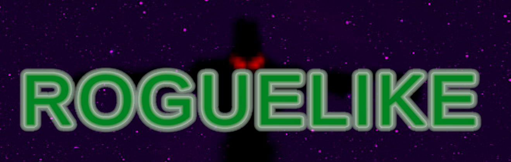
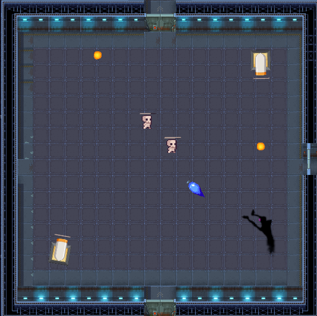
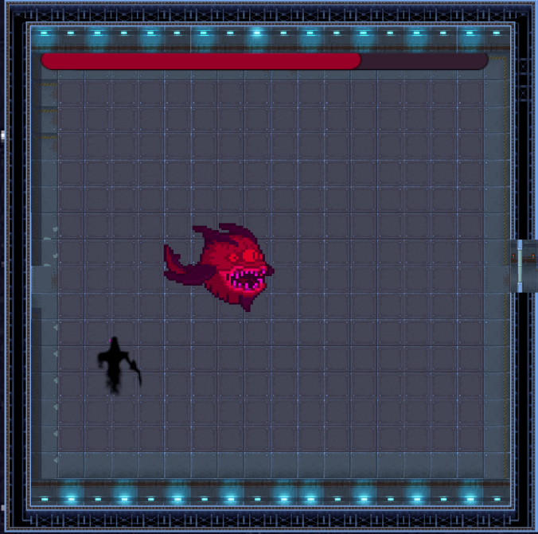
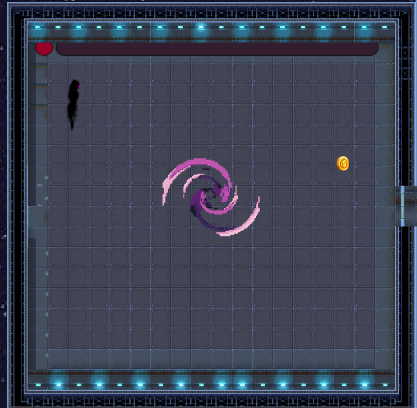
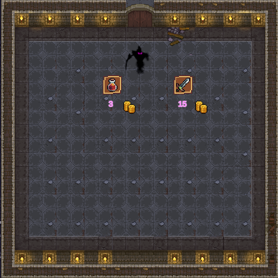
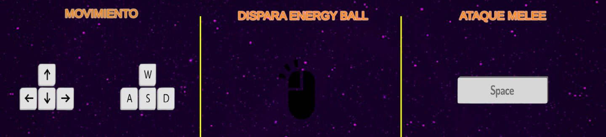
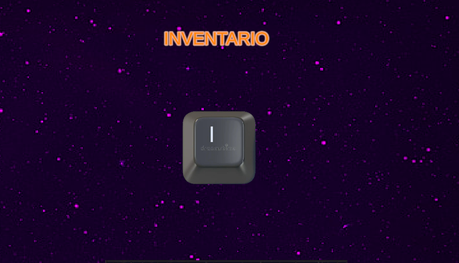

<!-- PROJECT SHIELDS -->

<!-- PROJECT LOGO -->

  

  <h3 align="center">Roguelike M17</h3>

  

    Aprendiendo a programar videojuegos
  

<!-- TABLE OF CONTENTS -->

  
Índice

  <ol>
    <li>
      <a href="#about-the-project">Sobre el proyecto</a>
    </li>
    <li><a href="#contact">Contact</a></li>
  </ol>

<!-- ABOUT THE PROJECT -->
## Sobre el proyecto

En este proyecto el principal objectivo era crear un Roguelike con vista TOP-DOWN.

Objetivos del proyecto:

* Generación procedural del mapa, se nos ha propuesto que la generación de habitaciones y sus respectivas posiciones y enemigos sean aleatorios.
* Utilizar Blend-Tree para controlar las animaciones de nuestro personaje en 8 direcciones.
* Habilidades del personaje (Disparo rápido, melee)
* Sistema de inventario 
* Utilizar Scriptable-Objects

Nuestro Roguelike tiene dos enemigos pincipales que són el esqueleto y el cañón,
el esqueleto persigue al jugador y si este se acerca mucho durante 2 segundos el esqueleto explotará haciendo mucho daño al jugador. El cañón tiene un rango en el cual empezará a atacar al jugador disparando bolas de fuego repetidamente.

También tiene un jefe que rebota en las paredes de su respectiva habitación y al morir genera un portal para acceder al siguiente piso

Los jugadores podrán acceder a una tienda al comienzo de cada piso donde podrán conseguir mejoras para su personaje

Los controles principales son los siguientes:

(<a href="#readme-top">volver arriba</a>)

<!-- CONTACT -->
## Contact

Agustín Garibotto Villanueva  - agustin.garibotto.7e6@itb.cat

Samuel Arteaga Colmenares - samuel.arteaga.7e6@itb.cat

Link al projecte: [https://github.com/your_username/repo_name](https://github.com/AgusITB/M1702-R1-RogueLike/tree/main)

(<a href="#readme-top">back to top</a>)

